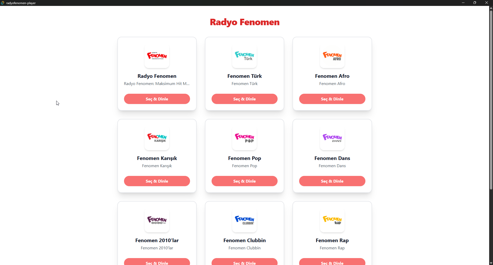
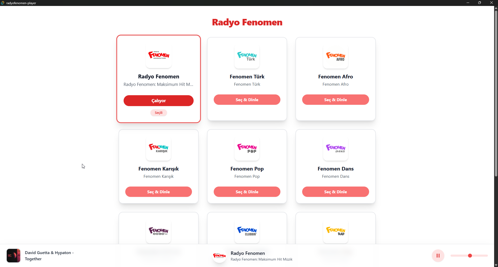

# Radyofenomen Player

Radyofenomen'den Türk radyo istasyonlarını dinlemek için modern masaüstü uygulaması. Optimal performans ve kullanıcı deneyimi için Rust, Tauri ve Yew ile geliştirilmiştir.

> ⚠️ **Uyarı:** Bu uygulama resmi bir sürüm değildir ve tamamen hobi amaçlı geliştirilmiştir. Herhangi bir ticari veya resmi kurumla bağlantısı yoktur.

## Özellikler

- 🎵 **Canlı Radyo Yayını**: Radyo Fenomen'den yüksek kaliteli canlı yayın.
- 🔊 **Ses Kontrolü**: Ses seviyesini ayarlayın ve tercihlerinizi kaydedin; bir sonraki açılışta otomatik olarak geri yüklenir.
- ⚡ **Hızlı Performans**: Optimal hız ve bellek verimliliği için Rust ile geliştirilmiş.

## Ekran Görüntüleri




## Kullanılan Teknolojiler

### Backend

- **Tauri**: Çapraz platform masaüstü framework'ü
- **Reqwest**: API iletişimi için HTTP istemcisi

### Frontend

- **Yew**: Rust tabanlı web framework'ü
- **Tailwind CSS**: Utility-first CSS framework'ü
- **WASM**: Native'e yakın performans için WebAssembly

## Önkoşullar

- [Rust](https://rustup.rs/) (en son kararlı sürüm)
- [Trunk](https://trunkrs.dev/) (frontend derlemesi için)
- [Node.js](https://nodejs.org/) (Sadece geliştirme için)

## Kurulum

### İndirme

En son sürümü doğrudan indirip kullanmak için [Releases](https://github.com/egedemirkiran/radyofenomen-player/releases) sayfasını ziyaret edin.

## Derleme

### Gerekli Araçlar

```bash
   # Frontend derlemesi için Trunk'ı yükleyin
   cargo install trunk
```

### Geliştirme Derlemesi

```bash
cargo tauri dev
```

### Üretim Derlemesi

```bash
cargo tauri build
```

Derlenmiş uygulama `target/release/` dizininde mevcut olacaktır.

## Katkıda Bulunma

Tüm katkılara açığız! Lütfen şu adımları izleyin:

1. Repository'yi fork edin
2. Özellik dalı oluşturun (`git checkout -b feature/amazing-feature`)
3. Değişikliklerinizi commit edin (`git commit -m 'Harika özellik ekle'`)
4. Dalı push edin (`git push origin feature/amazing-feature`)
5. Pull Request açın

### Geliştirme Kuralları

- Rust kodlama konvansiyonlarını takip edin
- Bileşenler arasında tip güvenliğini sağlayın
- Anlamlı commit mesajları kullanın

## Lisans

Bu proje MIT Lisansı altında lisanslanmıştır - detaylar için [LICENSE](LICENSE) dosyasına bakın.

## Teşekkürler

- Radyo yayın hizmetini sağladığı için [Radyofenomen](https://www.radyofenomen.com/)
- Rust tabanlı masaüstü geliştirme framework'ü için [Tauri](https://tauri.app/)
- Rust tabanlı frontend framework'ü için [Yew](https://yew.rs/)

## Destek

Herhangi bir sorunla karşılaşırsanız veya sorularınız varsa:

1. [Issues](https://github.com/egedemirkiran/radyofenomen-player/issues) sayfasını kontrol edin
2. Sorunu tekrarlamaya çalışın ve detaylı bilgilerle yeni bir issue oluşturun
3. İşletim sisteminizi ve Rust sürümünüzü belirtin

---

❤️ ile Rust ve modern web teknolojileri kullanılarak yapıldı.
